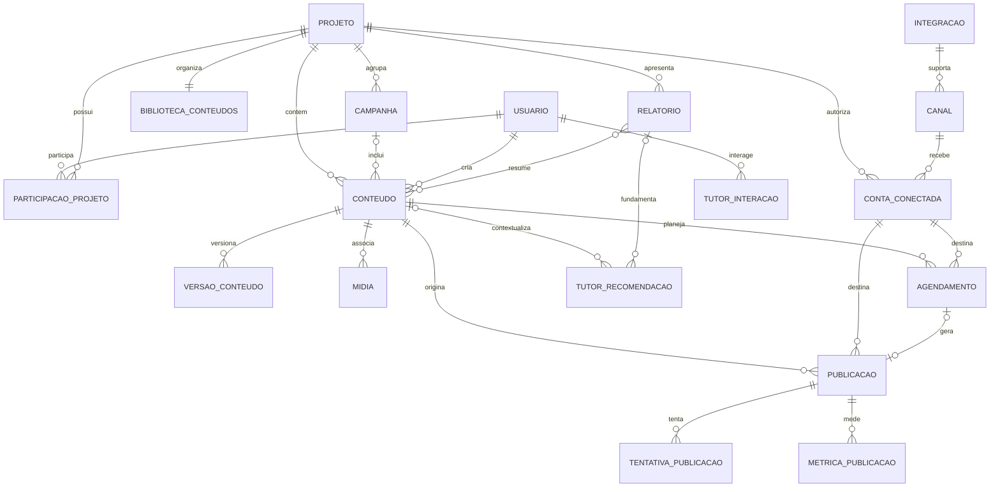

# Modelo de Dados do Domínio

**Versão:** 0.1

**Fase:** Sprint 2 — Domain Model

**Atualizado em:** 19 de julho de 2026

## 1. Objetivo

Descrever o modelo conceitual e lógico inicial das entidades do produto, seus atributos, identificadores, relacionamentos, cardinalidades e invariantes. Este documento não define tecnologia de persistência nem substitui decisões posteriores de arquitetura técnica.

## 2. Convenções

- Identificadores são representados como `id`, sem fixar formato físico.
- Entidades persistentes possuem `criado_em` e `atualizado_em` quando aplicável.
- Horários são persistidos com referência temporal inequívoca; o fuso do Usuário ou Projeto é mantido para apresentação e Agendamentos.
- Estados usam conjuntos controlados, não texto livre.
- Segredos e tokens nunca são persistidos em texto aberto nem incluídos em eventos ou logs.
- Exclusão lógica ou retenção histórica deve ser usada quando uma remoção física quebraria auditoria, Publicações ou Relatórios.
- Dados pertencentes ao Usuário são isolados pelo `projeto_id` sempre que fizerem parte de um contexto editorial.

## 3. Centro do modelo

`conteudo` é a entidade central. A fonte editorial vive em `conteudo` e em suas versões; todo envio aponta para uma versão congelada, e todo resultado retorna à Publicação e ao Conteúdo correspondentes.

```text
projeto
  └── biblioteca_conteudos
         └── conteudo
              ├── versao_conteudo
              ├── agendamento ── conta_conectada ── canal
              ├── publicacao  ── conta_conectada ── integracao
              └── relatorio / metrica_publicacao
                         │
                         └── tutor_interacao / recomendacao
```

## 4. Entidades e atributos

### 4.1 Usuário — `usuario`

**Finalidade:** identidade da pessoa que acessa e controla ações na plataforma.

| Campo | Obrigatório | Descrição |
|---|---:|---|
| `id` | Sim | Identificador único |
| `nome` | Sim | Nome de exibição |
| `email_ou_identificador_acesso` | Sim | Identificador normalizado e único para acesso |
| `idioma` | Sim | Idioma da experiência |
| `fuso_horario` | Sim | Fuso preferencial |
| `nivel_familiaridade_digital` | Não | Autodeclaração usada para adequar orientação |
| `objetivo_principal` | Não | Objetivo informado no onboarding |
| `publico_principal` | Não | Público que deseja alcançar |
| `estado_onboarding` | Sim | `nao_iniciado`, `em_andamento` ou `concluido` |
| `estado` | Sim | `ativo`, `bloqueado` ou `encerrado` |
| `criado_em`, `atualizado_em` | Sim | Auditoria temporal |

**Relacionamentos:** N:N com Projeto por `participacao_projeto`; 1:N com Conteúdo como autor; 1:N com Agendamento e Publicação como solicitante; 1:N com interações do Tutor.

Dados de autenticação, sessões e consentimentos podem ser armazenados em estruturas especializadas ligadas ao `usuario_id`.

### 4.2 Projeto — `projeto`

**Finalidade:** separar o contexto editorial de uma igreja, negócio, marca ou iniciativa.

| Campo | Obrigatório | Descrição |
|---|---:|---|
| `id` | Sim | Identificador único |
| `nome` | Sim | Nome reconhecível pelo Usuário |
| `descricao` | Não | Contexto resumido |
| `objetivo` | Não | Resultado editorial pretendido |
| `publico` | Não | Público principal |
| `identidade_editorial` | Não | Tom, temas e orientações de comunicação |
| `fuso_horario` | Sim | Referência de calendário e Agendamentos |
| `proprietario_usuario_id` | Sim | Usuário responsável |
| `estado` | Sim | `ativo` ou `arquivado` |
| `criado_em`, `atualizado_em` | Sim | Auditoria temporal |

**Relacionamentos:** N:N com Usuário; 1:1 com Biblioteca de Conteúdos; 1:N com Conteúdo, Conta Conectada, Campanha e Relatório.

### 4.3 Participação no Projeto — `participacao_projeto`

**Finalidade:** materializar a relação entre Usuário e Projeto e permitir papéis futuros.

| Campo | Obrigatório | Descrição |
|---|---:|---|
| `projeto_id` | Sim | Projeto acessado |
| `usuario_id` | Sim | Usuário participante |
| `papel` | Sim | No MVP, `proprietario` |
| `estado` | Sim | `ativo` ou `removido` |
| `criado_em`, `atualizado_em` | Sim | Auditoria temporal |

**Restrição:** o par ativo `projeto_id + usuario_id` é único e todo Projeto possui exatamente um proprietário no MVP.

### 4.4 Biblioteca de Conteúdos — `biblioteca_conteudos`

**Finalidade:** representar a organização lógica dos Conteúdos de um Projeto.

| Campo | Obrigatório | Descrição |
|---|---:|---|
| `id` | Sim | Identificador único |
| `projeto_id` | Sim | Projeto proprietário |
| `ordenacao_padrao` | Sim | Critério inicial de apresentação |
| `preferencias_visualizacao` | Não | Configuração de lista, filtros e agrupamentos |
| `criado_em`, `atualizado_em` | Sim | Auditoria temporal |

**Relacionamentos:** 1:1 com Projeto; apresenta 1:N Conteúdos pelo `projeto_id`.

**Restrição:** existe no máximo uma Biblioteca principal por Projeto. Biblioteca não é proprietária de cópias de Conteúdo; é uma projeção organizacional.

### 4.5 Conteúdo — `conteudo`

**Finalidade:** guardar a identidade e o estado da unidade editorial central.

| Campo | Obrigatório | Descrição |
|---|---:|---|
| `id` | Sim | Identificador único |
| `projeto_id` | Sim | Contexto proprietário |
| `autor_usuario_id` | Sim | Autor inicial |
| `campanha_id` | Não | Agrupamento opcional |
| `titulo_interno` | Sim | Nome usado para localização |
| `objetivo` | Não | Finalidade específica |
| `publico` | Não | Público pretendido |
| `tipo` | Sim | Tipo editorial controlado |
| `mensagem_principal` | Não | Síntese da mensagem |
| `estado_editorial` | Sim | Estado resumido do ciclo |
| `versao_atual_id` | Não | Versão editável corrente |
| `arquivado_em` | Não | Instante de arquivamento |
| `criado_em`, `atualizado_em` | Sim | Auditoria temporal |

**Relacionamentos:** N:1 com Projeto; N:1 opcional com Campanha; 1:N com Versão de Conteúdo, Mídia, Etiqueta, Agendamento, Publicação e registros usados em Relatórios.

**Invariantes:**

- pertence a exatamente um Projeto;
- pode existir antes de qualquer conexão externa;
- uma versão publicada é imutável;
- `versao_atual_id`, quando presente, aponta para uma versão do próprio Conteúdo;
- arquivar não remove relações históricas.

### 4.6 Versão de Conteúdo — `versao_conteudo`

**Finalidade:** preservar mudanças editoriais e congelar exatamente o que será ou foi publicado.

| Campo | Obrigatório | Descrição |
|---|---:|---|
| `id` | Sim | Identificador único |
| `conteudo_id` | Sim | Conteúdo de origem |
| `numero` | Sim | Sequência crescente dentro do Conteúdo |
| `corpo` | Sim | Representação editorial da versão |
| `canal_id` | Não | Canal para o qual foi adaptada |
| `origem_versao_id` | Não | Versão fonte de uma adaptação |
| `criada_por_usuario_id` | Sim | Responsável pela aceitação da versão |
| `estado` | Sim | `editavel`, `pronta` ou `congelada` |
| `criado_em` | Sim | Auditoria temporal |

**Restrição:** o par `conteudo_id + numero` é único; versões `congelada` não podem ser alteradas.

### 4.7 Mídia — `midia`

**Finalidade:** referenciar arquivos ligados ao Conteúdo e suas versões.

| Campo | Obrigatório | Descrição |
|---|---:|---|
| `id` | Sim | Identificador único |
| `conteudo_id` | Sim | Conteúdo proprietário |
| `versao_conteudo_id` | Não | Versão específica, quando aplicável |
| `tipo` | Sim | Imagem, áudio, vídeo ou documento suportado |
| `nome_original` | Sim | Nome informado no envio |
| `referencia_armazenamento` | Sim | Referência interna, não endereço público permanente |
| `tipo_mime`, `tamanho_bytes` | Sim | Metadados para validação |
| `largura`, `altura`, `duracao` | Não | Metadados conforme o tipo |
| `estado_validacao` | Sim | `pendente`, `valida` ou `invalida` |
| `criado_em` | Sim | Auditoria temporal |

### 4.8 Campanha — `campanha` (opcional)

**Finalidade:** agrupar Conteúdos relacionados a uma iniciativa.

| Campo | Obrigatório | Descrição |
|---|---:|---|
| `id` | Sim | Identificador único |
| `projeto_id` | Sim | Projeto proprietário |
| `nome` | Sim | Nome da iniciativa |
| `objetivo`, `publico` | Não | Contexto compartilhado |
| `inicio_em`, `fim_em` | Não | Período planejado |
| `estado` | Sim | `rascunho`, `ativa`, `concluida` ou `arquivada` |
| `criado_em`, `atualizado_em` | Sim | Auditoria temporal |

**Relacionamentos:** N:1 com Projeto; 1:N com Conteúdo; pode ser dimensão de Relatório.

### 4.9 Canal — `canal`

**Finalidade:** catalogar um destino digital e suas capacidades funcionais.

| Campo | Obrigatório | Descrição |
|---|---:|---|
| `id` | Sim | Identificador único |
| `integracao_id` | Sim | Integração responsável |
| `codigo` | Sim | Código interno estável e único |
| `nome` | Sim | Nome apresentado |
| `categoria` | Sim | Tipo de serviço |
| `capacidades` | Sim | Operações suportadas |
| `formatos_e_limites` | Sim | Regras de conteúdo e mídia |
| `metricas_disponiveis` | Não | Catálogo de métricas |
| `estado` | Sim | `disponivel`, `degradado` ou `indisponivel` |
| `atualizado_em` | Sim | Auditoria temporal |

**Relacionamentos:** N:1 com Integração; 1:N com Conta Conectada; 1:N com versões adaptadas, Agendamentos e Publicações.

### 4.10 Integração — `integracao`

**Finalidade:** representar o adaptador e a configuração operacional de um provedor externo.

| Campo | Obrigatório | Descrição |
|---|---:|---|
| `id` | Sim | Identificador único |
| `provedor` | Sim | Serviço externo |
| `versao` | Sim | Versão do contrato implementado |
| `capacidades` | Sim | Autorização, publicação, estado e métricas suportados |
| `politica_tentativas` | Sim | Limites e intervalos de recuperação |
| `limites_operacionais` | Não | Limites conhecidos do provedor |
| `referencia_credencial_plataforma` | Não | Referência protegida, nunca o segredo aberto |
| `estado` | Sim | `ativa`, `degradada` ou `inativa` |
| `ultima_verificacao_em` | Não | Saúde operacional |
| `criado_em`, `atualizado_em` | Sim | Auditoria temporal |

**Relacionamentos:** 1:N com Canal e operações das Contas Conectadas, Publicações e métricas.

### 4.11 Conta Conectada — `conta_conectada`

**Finalidade:** guardar o vínculo autorizado com uma conta externa de um Canal.

| Campo | Obrigatório | Descrição |
|---|---:|---|
| `id` | Sim | Identificador único |
| `projeto_id` | Sim | Projeto que utilizará a conta |
| `canal_id` | Sim | Canal da conta |
| `autorizada_por_usuario_id` | Sim | Usuário que consentiu |
| `identificador_externo` | Sim | Identificador retornado pelo provedor |
| `nome_externo` | Sim | Nome apresentado para confirmação de destino |
| `referencia_credencial` | Sim | Referência protegida do token ou autorização |
| `permissoes` | Sim | Escopos concedidos |
| `estado` | Sim | `autorizando`, `ativa`, `requer_reconexao`, `falhou` ou `desconectada` |
| `expira_em` | Não | Expiração conhecida |
| `ultima_verificacao_em` | Não | Última validação de saúde |
| `criado_em`, `atualizado_em` | Sim | Auditoria temporal |

**Restrição:** uma Conta Conectada só pode ser usada por objetos do mesmo Projeto.

### 4.12 Agendamento — `agendamento`

**Finalidade:** representar uma intenção confirmada de publicação futura.

| Campo | Obrigatório | Descrição |
|---|---:|---|
| `id` | Sim | Identificador único |
| `conteudo_id` | Sim | Conteúdo a publicar |
| `versao_conteudo_id` | Sim | Versão preparada |
| `conta_conectada_id` | Sim | Destino autorizado |
| `criado_por_usuario_id` | Sim | Responsável pela decisão |
| `publicar_em` | Sim | Instante de execução |
| `fuso_horario_original` | Sim | Contexto informado pelo Usuário |
| `estado` | Sim | `rascunho`, `confirmado`, `em_execucao`, `executado`, `cancelado` ou `falhou` |
| `executado_em`, `cancelado_em` | Não | Marcos do ciclo |
| `criado_em`, `atualizado_em` | Sim | Auditoria temporal |

**Relacionamentos:** N:1 com Conteúdo, Versão e Conta Conectada; 0:1 com Publicação resultante.

**Invariantes:** versão e Conta Conectada pertencem ao mesmo contexto do Conteúdo; somente Agendamento confirmado pode executar; cancelado não executa.

### 4.13 Publicação — `publicacao`

**Finalidade:** registrar cada distribuição aprovada e seu resultado externo.

| Campo | Obrigatório | Descrição |
|---|---:|---|
| `id` | Sim | Identificador único |
| `conteudo_id` | Sim | Conteúdo de origem |
| `versao_conteudo_id` | Sim | Versão congelada enviada |
| `conta_conectada_id` | Sim | Destino real |
| `agendamento_id` | Não | Origem quando agendada |
| `solicitada_por_usuario_id` | Sim | Responsável pela aprovação |
| `chave_idempotencia` | Sim | Proteção contra duplicidade |
| `estado` | Sim | `aguardando_confirmacao`, `na_fila`, `processando`, `publicada`, `falhou` ou `cancelada` |
| `identificador_externo`, `endereco_externo` | Não | Referências após aceite do Canal |
| `solicitada_em`, `publicada_em` | Não | Marcos temporais |
| `codigo_erro`, `mensagem_erro_sanitizada` | Não | Diagnóstico sem segredo |
| `criado_em`, `atualizado_em` | Sim | Auditoria temporal |

**Relacionamentos:** N:1 com Conteúdo, Versão e Conta Conectada; 0:1 com Agendamento; 1:N com Tentativa de Publicação e Métrica de Publicação.

**Invariantes:** a versão torna-se imutável antes do envio; `chave_idempotencia` é única no escopo do destino; Publicação nunca muda de um estado final para processamento.

### 4.14 Tentativa de Publicação — `tentativa_publicacao`

**Finalidade:** registrar cada chamada externa sem confundir nova tentativa com nova intenção editorial.

| Campo | Obrigatório | Descrição |
|---|---:|---|
| `id` | Sim | Identificador único |
| `publicacao_id` | Sim | Publicação executada |
| `numero` | Sim | Ordem crescente |
| `iniciada_em`, `finalizada_em` | Sim/Não | Duração da tentativa |
| `resultado` | Sim | `aceita`, `rejeitada`, `incerta` ou `erro_temporario` |
| `codigo_externo`, `erro_sanitizado` | Não | Diagnóstico seguro |

**Restrição:** o par `publicacao_id + numero` é único; resultado incerto exige reconciliação antes de novo envio.

### 4.15 Relatório — `relatorio`

**Finalidade:** representar uma visão calculada de resultados em um período e escopo definidos.

| Campo | Obrigatório | Descrição |
|---|---:|---|
| `id` | Sim | Identificador único |
| `projeto_id` | Sim | Contexto proprietário |
| `nome` | Sim | Identificação da visão |
| `tipo_escopo` | Sim | Projeto, Conteúdo, Campanha, Canal ou Conta |
| `referencia_escopo_id` | Não | Identificador conforme o escopo |
| `periodo_inicio`, `periodo_fim` | Sim | Janela analisada |
| `resumo` | Não | Explicação calculada ou editorial |
| `ultima_atualizacao_em` | Não | Atualidade dos dados |
| `estado` | Sim | `pendente`, `atualizado`, `parcial` ou `indisponivel` |
| `criado_em`, `atualizado_em` | Sim | Auditoria temporal |

**Relacionamentos:** N:1 com Projeto; N:N lógico com Conteúdo e Publicação por meio do escopo e das métricas; 1:N com recomendações do Tutor.

### 4.16 Métrica de Publicação — `metrica_publicacao`

**Finalidade:** armazenar uma observação de resultado com origem e período explícitos.

| Campo | Obrigatório | Descrição |
|---|---:|---|
| `id` | Sim | Identificador único |
| `publicacao_id` | Sim | Publicação medida |
| `codigo_metrica` | Sim | Métrica no catálogo do Canal |
| `valor` | Sim | Valor observado |
| `periodo_inicio`, `periodo_fim` | Sim | Janela da observação |
| `coletada_em` | Sim | Momento da coleta |
| `fonte` | Sim | Canal e operação de origem |

**Restrição:** métricas com nomes semelhantes não são agregadas entre Canais sem regra de normalização explícita.

### 4.17 Tutor — `tutor_interacao` e `tutor_recomendacao`

**Finalidade:** persistir o contexto mínimo necessário para continuidade da orientação e rastreabilidade das recomendações.

`tutor_interacao`:

| Campo | Obrigatório | Descrição |
|---|---:|---|
| `id` | Sim | Identificador único |
| `usuario_id`, `projeto_id` | Sim | Contexto da conversa ou orientação |
| `etapa_jornada` | Sim | Etapa em que ocorreu |
| `tipo` | Sim | Explicação, pergunta, ajuda ou feedback |
| `referencia_entidade`, `referencia_id` | Não | Objeto contextual, como Conteúdo ou Publicação |
| `resumo_interacao` | Sim | Registro minimizado, conforme política de dados |
| `criado_em` | Sim | Auditoria temporal |

`tutor_recomendacao`:

| Campo | Obrigatório | Descrição |
|---|---:|---|
| `id` | Sim | Identificador único |
| `usuario_id`, `projeto_id` | Sim | Destinatário e contexto |
| `conteudo_id`, `relatorio_id` | Não | Evidências relacionadas |
| `tipo` | Sim | Próximo passo sugerido |
| `explicacao` | Sim | Justificativa compreensível |
| `estado` | Sim | `apresentada`, `aceita`, `adaptada`, `rejeitada` ou `expirada` |
| `criado_em`, `respondido_em` | Sim/Não | Auditoria temporal |

**Invariantes:** recomendação não executa publicação ou conexão; dados usados devem pertencer ao mesmo Projeto; interações respeitam minimização e retenção definidas.

## 5. Diagrama de relacionamentos



## 6. Raízes de agregados e limites de consistência

| Agregado | Raiz | Componentes internos ou dependentes | Limite transacional pretendido |
|---|---|---|---|
| Projeto | `projeto` | participação e Biblioteca | Configuração e acesso ao contexto |
| Conteúdo | `conteudo` | versões, mídias e etiquetas | Edição e mudança de estado editorial |
| Conta Conectada | `conta_conectada` | permissões e saúde | Ciclo de autorização externa |
| Agendamento | `agendamento` | decisão de execução futura | Confirmar, reagendar, cancelar ou iniciar |
| Publicação | `publicacao` | tentativas | Congelar versão, enviar e reconciliar estado |
| Relatório | `relatorio` | visão calculada | Atualizar visão sem alterar dados de origem |
| Tutor | `tutor_interacao` | recomendações relacionadas | Registrar orientação sem executar ação externa |

Publicação e coleta de métricas atravessam sistemas externos; por isso usam consistência eventual, estados explícitos e reconciliação. Não se presume transação distribuída com o Canal.

## 7. Regras de integridade entre entidades

1. Todo Conteúdo, Conta Conectada, Campanha e Relatório pertence a um Projeto.
2. Um Usuário só age em um Projeto com participação ativa.
3. Biblioteca apresenta apenas Conteúdos do próprio Projeto.
4. Campanha e Conteúdo relacionados pertencem ao mesmo Projeto.
5. Versão, Agendamento e Publicação sempre apontam para o mesmo Conteúdo de origem.
6. Conta Conectada usada em Agendamento ou Publicação pertence ao mesmo Projeto do Conteúdo.
7. Canal da versão preparada deve ser compatível com o Canal da Conta Conectada.
8. Publicação usa uma versão congelada e uma chave de idempotência.
9. Publicação confirmada externamente nunca é apagada para simular que não ocorreu.
10. Métrica aponta para Publicação válida e preserva fonte, período e coleta.
11. Relatório não altera Métricas de Publicação; apenas as seleciona, agrega e explica.
12. Tutor pode ler contexto autorizado e registrar recomendações, mas não modificar entidades de ação sem comando explícito do Usuário.

## 8. Dados sensíveis e retenção

- Credenciais de acesso e de Integrações são armazenadas por mecanismo de segredos e referenciadas no modelo.
- Conteúdo e mídias podem conter dados pessoais; acesso e retenção seguem o Projeto e o consentimento aplicável.
- Logs e eventos analíticos usam identificadores e estados mínimos, sem corpo de Conteúdo ou tokens.
- Revogação de Conta Conectada remove ou inutiliza credenciais, preservando registros históricos necessários.
- Encerramento de Usuário ou Projeto exige política explícita para anonimização, exclusão e retenção legal de auditoria.
- Interações com o Tutor devem coletar somente o necessário para continuidade e melhoria autorizada.

## 9. Eventos de domínio candidatos

| Evento | Entidade de origem | Consumidores principais |
|---|---|---|
| `ProjetoConfigurado` | Projeto | Tutor e onboarding |
| `ContaConectadaAtivada` | Conta Conectada | Tutor e canais |
| `ContaRequerReconexao` | Conta Conectada | Tutor e notificações |
| `ConteudoCriado` | Conteúdo | Biblioteca e Tutor |
| `ConteudoPronto` | Conteúdo | Publicação e Tutor |
| `AgendamentoConfirmado` | Agendamento | Executor e Tutor |
| `AgendamentoVencido` | Agendamento | Publicação e notificações |
| `PublicacaoSolicitada` | Publicação | Integração |
| `PublicacaoConcluida` | Publicação | Relatório, Biblioteca e Tutor |
| `PublicacaoFalhou` | Publicação | Tutor, operação e notificações |
| `MetricasAtualizadas` | Métrica de Publicação | Relatório e Tutor |
| `RecomendacaoRespondida` | Tutor | Aprendizado do produto |

Eventos comunicam fatos concluídos. Não devem carregar credenciais nem o corpo integral do Conteúdo.

## 10. Recorte do modelo para o MVP

### Necessário no primeiro ciclo

- Usuário;
- Projeto e participação de proprietário;
- Biblioteca de Conteúdos;
- Conteúdo, Versão de Conteúdo e Mídia quando o formato exigir;
- Canal, Integração e Conta Conectada;
- Publicação e Tentativa de Publicação;
- Métrica de Publicação e Relatório simples;
- interação e recomendação básica do Tutor.

### Modelado, mas adiável

- Agendamento, caso o MVP use somente publicação imediata;
- Campanha;
- papéis colaborativos além de proprietário;
- relatórios comparativos e normalização multicanal;
- versões adaptadas para múltiplos Canais;
- recomendações avançadas ou personalizadas por histórico amplo.

## 11. Decisões pendentes

- formato físico dos identificadores;
- provedor de autenticação e separação dos dados de acesso;
- representação do corpo por tipo de Conteúdo;
- armazenamento, transformação e remoção de mídias;
- taxonomia de etiquetas e tipos editoriais;
- persistência material ou calculada da Biblioteca;
- suporte a um Conteúdo em múltiplas Campanhas no futuro;
- catálogo e normalização de métricas;
- retenção de versões, eventos, relatórios e interações do Tutor;
- estratégia técnica de segredos, idempotência e reconciliação.

## 12. Critérios de validação

O modelo estará pronto para detalhamento físico quando o MVP confirmar o Canal e o formato iniciais, o protótipo validar os conceitos com usuários, a Integração comprovar seus identificadores e estados, e as políticas de autorização, consentimento, retenção e métricas estiverem definidas.
